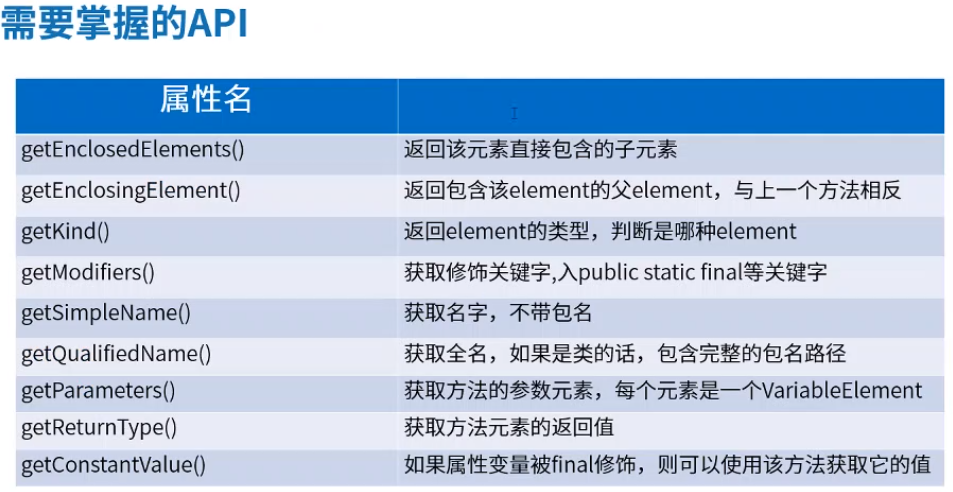
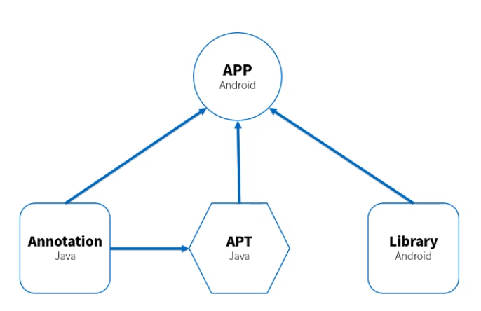

手写ButterKnife,造币器
- 控件注入框架 ,不支持private,static,因为module 之间不支持访问private
- ButterKnife 加载一个临时创建的类
- 最后还是通过 `findViewById` 实现控件绑定
- 最后apt生成的类在 `E:\willkernel\ButterKnifeTest\app\build\intermediates\javac\debug\compileDebugJavaWithJavac\classes\com\willkernel\butterknifetest`


优势
1. 强大的view绑定和click事件处理功能,简化代码,提升开发效率
2. 方便处理adapter和viewholder绑定问题
3. 运行时不会影响app效率,配置方便
4. 代码清晰, 可读性强

和Ioc架构的区别
1. 同样实现解耦
2. 运行时通过反射(reflect) vs 注解处理器(APT)
3. Ioc编程更具挑战
4. reflect 会消耗一定性能,APT会增加apk大小
5. 更偏向编译器的APT技术

app/build.gradle 配置
```
implementnation 'com.jakewharton:butterknife:10.1.0'
annotatioProcessor 'com.jakewharton:butterknife-compiler:10.1.0'

或者netease
implementation 'com.cmonbaby:NetEase_ButterKnife_Library:1.1.3'
implementation 'com.cmonbaby:NetEase_ButterKnife_Annotation:1.1.3'
annotationProcessor 'com.cmonbaby:NetEase_ButterKnife_Complier:1.1.3'
```

安装插件plugin  Android ButterKnife Zelezny
xml布局需要R.id.tv,需要在R.layout.activity_main 上右键点击生成butterknife


#### APT
处理注解的工具,原代码文件进行检测找出其中的Annotation,根据注解自动生成代码,如果想要
自定义注解处理器能够正常运行,必须通过APT工具来进行处理,也可以这样理解,只有通过APT工具后,
程序在编译期间自定义注解解释器才能执行

#### Java也是一种结构体语言
- Element程序元素
- PackageElement 包程序元素,提供对有关包及其成员的信息访问
- ExecutableElement 表示某个类或接口的方法,构造方法,初始化程序(静态或实例)
- TypeElement 表示一个类或接口的程序元素,提供对有关类型,成员信息的访问
- VariableElement 表示一个字段,enum常量,方法,构造方法,参数,局部变量,资源变量或异常参数
- Parameterizable：表示混合类型的元素（不仅只有一种类型的Element)
- TypeParameterElement：带有泛型参数的类、接口、方法或者构造器。
- QualifiedNameable：具有限定名称的元素

- api



- app, module 之间的依赖关系 , app 依赖 Annotation(Java lib),Library(Android lib),Compiler(Java lib 注解处理器apt), Compiler 依赖 Annotation



---
[Module 编译生成的 Jar,Arr 区别](https://www.jianshu.com/p/0a2572a63ed5)

[jar与aar的区别及使用方法](https://www.jianshu.com/p/99a7bae4193f)


#### 遇到注解处理器的坑
- gradle 依赖的线上ButterKnife, project/build.gradle  classpath 可以使用3.4.0  gradle-5.1.1-all
- 本地依赖的apt module, project/build.gradle classpath不能使用3.4.0 改为 3.3.0  gradle-4.10.1-all
- java module 使用中文需要配置UTF-8编码
```
tasks.withType(JavaCompile) {
    options.encoding = "UTF-8"
}
```
